# Git Workshop
This pre-phase 1 workshop is designed for people who have little or no experience in Git and GitHub. You will be using GitHub for your phase 1 and phase 2 projects, so it's helpful to learn about it now.

In this workshop, we'll not only learn about the basics of Git and GitHub, like - what is a commit? what is a branch? , but also about the advanced features, like - pull requests. We will also do some hands-on practice so you can understand and master the basics. We'll be there to support you guys during this practice round.

As always, you can ask us any questions that you might have during this workshop. We'll also be available in the discord chat after the workshop.

# What to Bring 
Make sure you have downloaded and installed the following applications before the workshop:
* Git ( download link: https://git-scm.com/downloads )
* GitHub Desktop ( download link: https://desktop.github.com/ )
* VS Code ( download link: https://code.visualstudio.com/download ) 

Note: VS Code is not necessary; any code editor would work.

<h3>Please make a GitHub account before the workshop starts. You will use this in the practical part of the workshop.</h3>

# Info 
* MSA Website:  https://msa.azurewebsites.net
* Discord: https://discord.gg/YkAHJWf

# Learn Github hands on!

## Follow these instructions for the live participation section :)

## **Getting Ready:**

## 1.0 Fork the main repository

- Navigate to https://github.com/NZMSA/Intro-To-Git
- Click on the Fork button. This creates your own copy of the reporitory on your own Github account.
  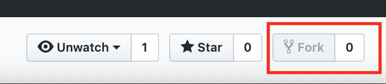 

## 1.1 Clone the Repository

- In your own fork repository on github, click on the green "Clone or download" button. Make sure its your own fork, and not the MSA one.
  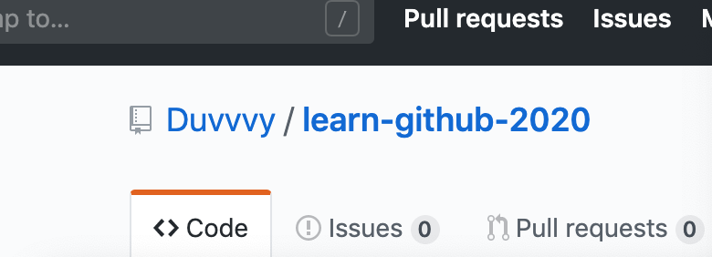 

- Now you want to click, open in desktop.

## 1.2 If you have mulitple organisations
- In my account, I am linked with different organisations, so I just have to click an extra button here.
  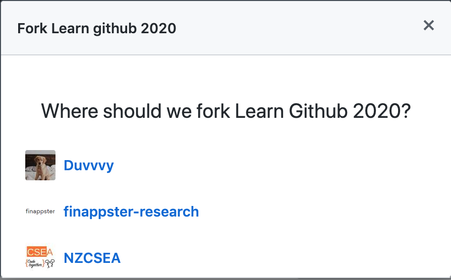 

## **Version Tracking**

## 2. Create a new text file

- Open the repository in your text editor (VsCode) and create a new text file with your name (e.g: ryanbircham.txt).

* Add one line to the text file about your favourite studying snack.

  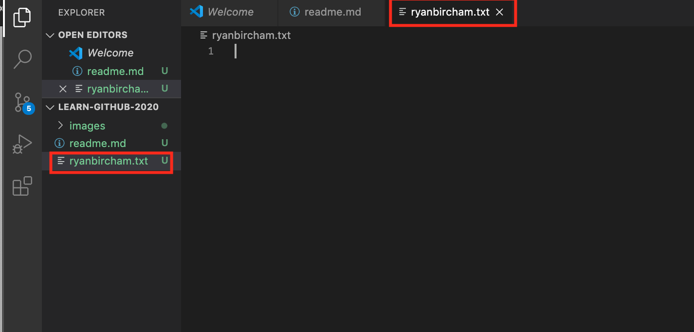

## 3. Check the current git stage

- Save the text file and look in github desktop:

- This should show the new file in the staging area or 'changes' area.

  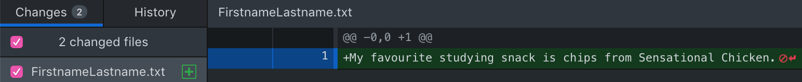

## 4. Commit your changes

- Down the botom left of github desktop, add a summary such as "added ryanbircham.txt" and press commit.
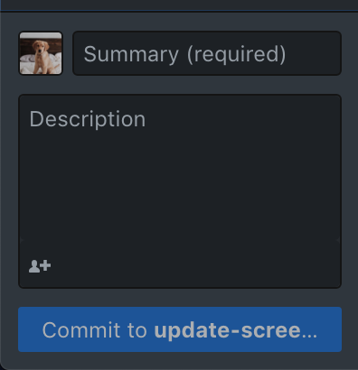
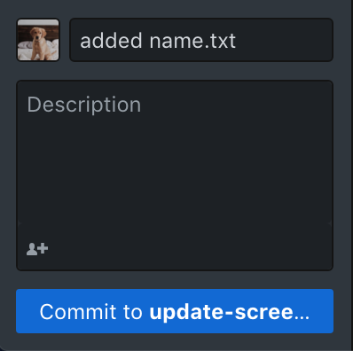

## 5. Check the status again

- This will show there is no new changes! (Beause the changes got committed!)
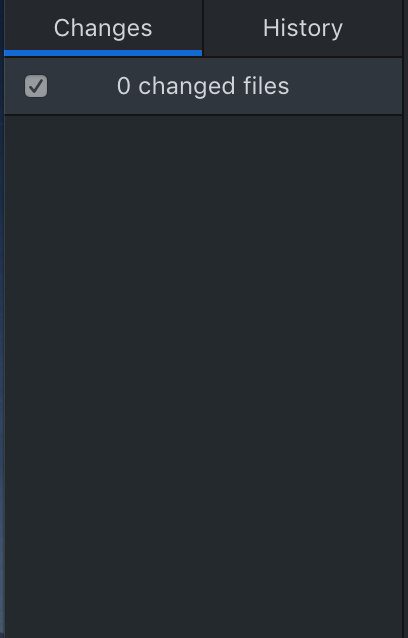

## 6. Check the git history

- You can view the history of commits in your branch by clicking history.
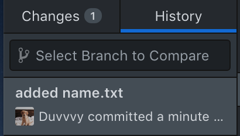

## 7. Add another change

- Now that you have created a commit, add a second line to the file you created.
- The second line can be about your favourite colour.
- Save the file.
- Commit the changes to your repo
- Using the history tab, you will be able to see your second commit!

## 8. Add a third line and commit them

- Repeat step 7 and check the git history. 
- The third line can be about your favourite song.
- You should see a third commit you made!
- Congratulations! You have successfully added version control to your new file! The following steps help create a pull request to get these new changes into the remote repostory.

## 9. Now push your changes to the cloud
- Press the push origin button.
- Origin is the remote server (GitHub).
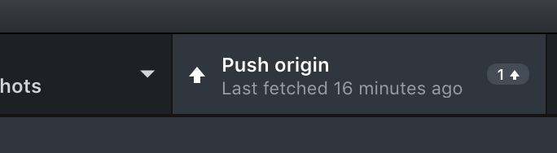
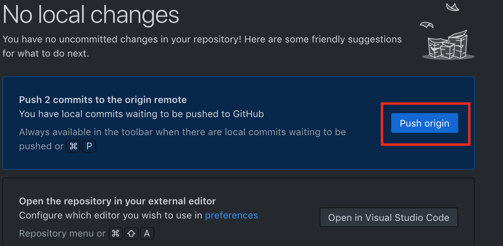

---

## **Collaboration**

## Create a Pull Request

- Navigate to your fork URL (e.g. https://github.com/{yourusername}/Intro-To-Git
- Click on the "New Pull Request" button

- Check the fork you wish to make the pull request from is your personal forked repository master branch

- Click the green "Create pull request" button.
- Congratulations, you have successfully made a Pull Request to the remote repository. Now you will have to wait until the owner of the repository approves and merges your pull request.

## Seeing your changes

- Once your changes have been approved and merged, you can see your changes and other people's changes to the remote repository on https://github.com/NZMSA/Intro-To-Git

- These changes are now MSA's my master branch!
